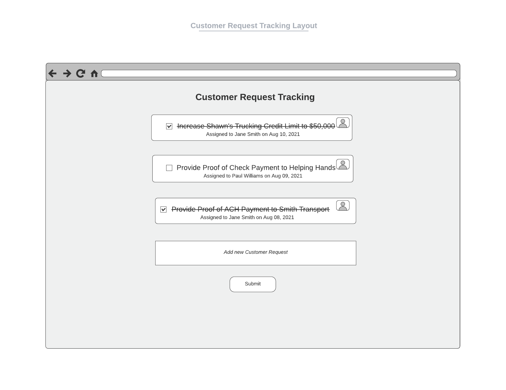

# Create a Customer Request Tracking Center for Operations Team
## Product Team
|                  |                  |
|------------------|------------------|
| Business Sponsor | Taylor           |
| Domain Experts   | Dani, Walter     |
| Tech Lead        | [Your Name Here] |
| Design Lead      | Shon             |

## Problem
As C2FO's customer base rapidly grows, the Operations team faces increasing difficulties keeping track of customer requests. The VP of Operations estimates that his team spends about 25% of their time manually capturing and tracking these customer requests, which is a costly use of the team's time.

To reduce this bottleneck, the Engineering team needs to build a customer request tracking system that enables the Operations team to write up request tickets and automatically assign them to team members. Operations team members will see all customer requests and can check them off as they work through them.

## Appetite
Although this feature is essential to the Operations team, we want to limit the amount of time we spend on it to a **maximum of four hours**.

## Use Cases
1. An Operations team member receives a request from a customer and types a description for the request into the request form. The page displays the new request at the top of the list.
2. An Operation team member clicks on the checkbox next to a customer request to signify completion. The request text should transform from normal style to ~~strikethrough~~.
3. An Operation team member clicks on the checkbox next to a customer request to uncheck it. The request text should transform from ~~strikethrough~~ to normal style.

## Solution
The agreed-on solution that the Operations team settled on is implementing the page shown in the mockup below.

### Design
To reduce the overhead with designing page elements from scratch, we make use of the [Material UI](https://mui.com/) library. For consistency, please use this library for styling components, diverging only if necessary.

There are no specific guidelines around pagination or handling scrolling as the list of items grows. These decisions are left up to the implementor to determine the best approach.

### Tasks
1. The current application is untested. Write a simple end-to-end test using libraries of your choosing that exercises the three use cases at a minimum (we use [Cypress](https://www.cypress.io/) and [React Testing Library](https://testing-library.com/docs/react-testing-library/intro/)).
2. The current implementation makes use of the `useState` hook for managing the application state; however, we recognize that the application will get more complex and would like to make use of a more robust (albeit more complex) state manager. Re-implement state management using a library of your choosing.
3. Fortunately, we can retrieve additional information from a REST API (including the user's profile picture and full name). GET the profile information for our Operations team members from https://randomuser.me/api?results=5&seed=c2fo-team&inc=name,picture,id,email and use the information to populate the display. Note that these profiles should never change.
4. Format the date so that it only displays the date (ignoring the time) as shown in the mockup.
5. (Optional) One of our overarching engineering philosophies is to leave the codebase better than you found it. If time permits, identify any areas of the codebase that can be improved and make these improvements. Examples of possible cleanup tasks could include making the code more DRY or adding component testing.

## Constraints
1. Do not commit any code to `main`.
2. Continue building on the code in this repository (i.e. do not create a new project from scratch).
3. Use feature branches and pull requests to work on your code.
4. Typically, we favor having small feature branches; however, for this task, it may be easier to have one feature branch and a single PR that encompasses the project to make it simpler for our engineering team to test.

## Hints
1. Don't get stressed out or worry if you cannot complete all the tasks in the allotted time. The idea is for our team to get a sense of how you prioritize work, think through solutions, and execute on those priorities. The goal is not to be feature complete but to demonstrate how you solve problems as a software engineer.
2. If you're experiencing any blockers or feeling stuck, don't hesitate to reach out to the hiring manager or designate, we are happy to communicate with you to resolve any uncertainties.
3. Enjoy the process and focus on showing your best work! The hard part is over, and you've made it this far. Now you're just doing the engineering work that you already know how to do!
